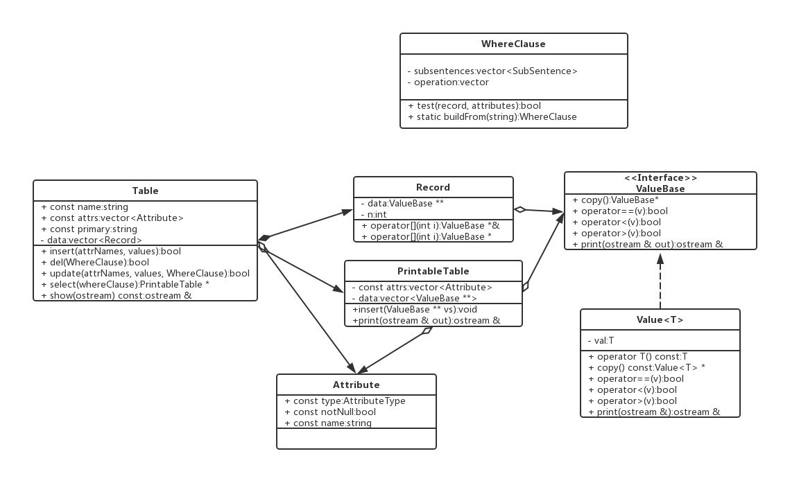

# 开发者说明文档

## 结构图

* `Table`: 数据表。存储数据，支持插入新行、删除满足条件的行、更新满足条件的行为给定值、选择出满足条件的行以组成一张可打印出到屏幕的表格。
* `Attribute`: 数据表内每列数据的属性。包括属性名称、属性的数据类型、属性是否为空。
* `Record`: 一条记录，即一行内的数据。
* `WhereClause`: Where子句类，将查询表达式以方便计算机计算的方式存储，并能判断某一条记录是否满足该子句的条件。
* `ValueBase`: 数据类型的基类。这是一个抽象类（接口），为了方便在其上重载了一些比较运算符，以及方便进行输出的方法。
* `Value<T>`: 为了将字符、整数、浮点数等不同的类型统一，用模板类`Value<T>`重新包装了这些类型。这些类型都继承于`ValueBase`。
* `PrintableTable`: 将用于屏幕输出的属性和数据集合。可以视作另一种只读、不可修改、只可以打印的数据表。
* `Sql`:解析输入的语句，根据输入调用合适的数据库接口，并且将结果输出。
* `Interpreter`:查询语句语法分析与结果输出，通过Interpreter调用Manager类型，根据输入调用合适的数据库接口，并将结果输出。
* `Manager`：包含一个Database向量，管理全部数据库。传入经过sql类型处理后的sql命令，调用相应函数，实现命令的要求。支持创建、删除数据库、显示所有数据库、访问特定数据库。
* `Database`:数据库类，管理数据表。支持插入、删除数据表、访问特定数据表。

# 接口说明

## Table.h

### class Table

存储每张特定数据表的数据存储器。

#### 私有成员变量
**`vector<Record> data`**

#### 公有成员变量
**`const string name`**

**`const vector<Attribute> attrs`**

属性列表。其顺序固定，不可以调换。  

**`const string primary`**

主键对应的属性名称。主键信息不储存在`Attribute`类中，通过在`Table`类中判断每一条属性的名称是否与主键相同，判断该条属性是否是主键。

#### 公有成员函数
**`Table(string name, vector<Attribute> a, string primary)`**

构造函数。 

@param name: 表名. attrs: 属性列表. primary: 主键名.
调用者应当避免不合法的参数，例如属性名冲突，主键名不存在于属性列表中，等等。
主键强制非空，无论传入的参数如何。

**`Table(const Table &) = delete`**

**`Table(Table &&)`**

**`bool insert(vector<string> attrNames, vector<ValueBase *> vals)`**

指定属性名`attrNames`和值`values`，插入新行。

值向量的顺序应当和参数`attrNames`的顺序匹配，但是后者不必和建表时指定属性名的顺序匹配。

返回是否成功。如果表中某一列不能为空但对应数据缺失，或者指定值类型与表格中属性类型不匹配，
或者指定的主键和已有的键发生冲突，或者重复指定了同一属性的值，就会发生失败。

在赋值时，传入的值会被复制而不是移动。即，传入值的指针不会被本`Table`对象接管。调用者
需要在插入操作完成后处理传入值的内存回收。

空值NULL以`nullptr`的形式传进来。

**`bool del(WhereClause c)`**

删除所有满足`whereClause`的行。

与本表无关的属性将会被忽略。如果`whereClause`中没有不被忽略的属性，表中所有的行都将被删除。

返回值总是`true`（成功）。

**`bool update(vector<string> attrNames, vector<ValueBase *> vals, WhereClause c)`**

更新满足`whereClause`的行，将`attrNames`中的属性值改为`vals`中的对应元素。

与本表无关的属性将会被忽略，无论实在`attrNames`中还是`whereClause`中。
如果没有不被忽略的属性`whereClause`，则表中所有的行都将被更新。

返回是否成功。如果指定的`vals`类型无法匹配，或者不能为空的列被修改为空，或主键被修改为了和已有
重复的值，会发生失败。

在赋值时，传入的值会被复制而不是移动。即，传入值的指针不会被本Table对象接管。调用者需要在
插入操作完成后处理传入值的内存回收。

**`PrintableTable * select(vector<string> attrFilter, WhereClause c)`**

选出满足`whereClause`的行，取出包含在`attrFilter`中的属性，组成一张新表并返回。

`attrFilter`: 需要选出的属性名称。如果欲选出所有属性，请传入一个仅包含字符串“*”的向量。

**`virtual ~Table()`**

**`ostream & show(ostream & out) const`**

通过传入的`ostream`对象输出表的属性信息。

### class PrintableTable

#### 私有成员变量
**`const vector<Attribute> attrs`**

属性列表。

**`vector<ValueBase **> data`**

数据列表。和`Table`不同之处在于，这里data使用二维动态数组存储。

#### 公有成员函数
**`PrintableTable(vector<Attribute> a)`**

**`void insert(ValueBase ** vs)`**

插入一条记录。

**`ostream & print(ostream & out)`**

通过给定的`ostream`将表的属性和全部数据输出。因此，你可以通过`cout`输出，也可以输出到文件中，还可以通过`stringstream`转成`string`。

**`~PrintableTable()`**

## Attribute.h

### class Attribute

#### 公有成员变量
**`const AttributeType type`**

属性类型。

**`const bool notNull`**

是否禁止非空。

**`const string name`**

属性名称。

#### 公有成员函数
**`Attribute(string name, AttributeType type, bool notNull)`**

直接构造。

**`Attribute(string name, string type, bool notNull)`**

根据输入构造，其中的`type`可以为`CHAR`,`INT`, `DOUBLE`等SQL规定数据类型中的一种。在第一阶段实现中，仅支持以上三种类型。

### enum AttributeType
`enum AttributeType {ATTR_INT, ATTR_CHAR, ATTR_DOUBLE}`

枚举类型，SQL中支持的数据类型集合。

### fromStringToAttrType(const string & )

`AttributeType fromStringToAttrType(const string & n)`

将字符串形式的属性类型转换为枚举类型形式，以用于`Attribute`的构造。

`@param s`

属性类型。大写。暂时只接受`"INT"`, `"CHAR"`和`"DOUBLE"`。

注：我们用`string`类型存储字符，这看起来很奇怪，因为字符长度总是为1，用`char`似乎即可……但是我们并不想改回去，原因是`CHAR`在MySQL中还有可能是字符串。

## Record.h

### class Record
每一行的数据组成一个Record.

内存管理提示：Record析构时会将其内部的所有数据进行析构。请谨慎将Record声明为局部变量。
#### 私有成员变量
**`int n`**

记录中包含多少属性的数据。总是与其所属的`Table`属性数量相同。

**`ValueBase ** data`**

#### 公有成员函数

**`Record(int n)`**

**`Record(const Record & r) `**

复制构造函数。

**`Record(Record && r) `**

移动构造函数。

**`Record & operator=(const Record & r)`**

赋值运算符重载。

**`ValueBase *& operator `**

下标运算符重载，可以修改对应的元素。

**`ValueBase * operator const`**

下标运算符重载，可以通过下标访问常量`Record`对象的数据。

**`~Record()`**

## Value.h
### class ValueBase

数据库内所储存数据的抽象基类。

#### 公有成员方法
**`virtual bool operator==(const ValueBase & v) const = 0`**

**`virtual bool operator>(const ValueBase & v) const = 0`**

**`virtual bool operator<(const ValueBase & v) const = 0`**

**`virtual ValueBase * copy() const = 0`**

创建自身的一个副本。

**`virtual ostream & print(ostream & out) const = 0`**

通过指定的`ostream`打印本对象。和下面重载的运算符相比，这一个可以由子类实现。

**`friend ostream & operator<<(ostream & out, ValueBase & v)`**

重载运算符。

**`virtual ~ValueBase() = 0`**

### class Value<T>

#### 定义

`template<class T> class Value<T>: public ValueBase`

程序内用`Value<int>`, `Value<double>`, `Value<string>`等类代表各种数据类型。

NULL没有对应的类型，在传递数据对象指针时用`nullptr`代表。

#### 私有成员变量
**`T v`**
#### 公有成员函数
**`operator T() const`**

类型转换函数。

**`bool operator==(const ValueBase & v) const override`**

**`bool operator>(const ValueBase & v) const override`**

**`bool operator<(const ValueBase & v) const override`**

尝试将v转换为Value<T>然后进行比较；若转换失败，返回false。

**`Value<T> * copy() const override`** 

**`ostream & print(ostream & out) const`**

**`~Value()`**

## sql.h

解析处理输入的sql语句

### class sql

解析输入的sql语言的基类，继承它的子类如下：

### class SQLCreateDatabase：

解析CREATE DATADATABASE命令。

### class SQLCreateTable：

解析 CREATE TABLE tableName(attrNameN TypeN)命令。

### class SQLShowColumns：

解析SHOW columns from tablenName命令。

### class SQLDropDatabase:

解析DROP DATABASE DBname命令。

### class SQLDropTable:

解析DROP TABLE tableName命令。

### class SQLUse:

解析USE DBname命令。

### class SQLInsert:

解析INSERT INTO [tableName(attrName1, attrName2,…, attrNameN)] VALUES (attrValue1, attrValue2,…, attrValueN) 命令。

### class SQLSelect:

解析SELECT AttrName FROM tableName WHERE whereClauses命令。

### class SQLDelete:

解析DELETE FROM tableName WHERE whereClauses命令。

### class SQLUpdate:

解析CREATE DATADATABASE命令。

### 主要接口：

**`void Parse(vector<string> sql) `**

以上数据类型根据各自处理的语法要求，分别对sql语句进行相应的分割和存储，方便后续接口操作进行。

## Interpreter.h

查询语句语法分析与结果输出，通过interpreter调用manager类型，根据输入调用合适的数据库接口，并将结果输出，是沟通程序内部数据库实现与外围输入输出的桥梁。

### class Interpreter

#### 私有成员变量

**` Manager *manager`**

存储了manager类型的指针，用于解析语句后，调用manager类的函数，实现功能。

**`string sql `**

存储输入语句。

**`vector<string> sql_vector `**

用向量存储输入语句的字符。

#### 公有成员函数

**`void SQL(string statement)`**

程序的外部接口，对sql命令进行相应的操作。

#### 私有成员函数
    
**` void SplitSQL(string statement)`**  

将输入的string类型命令依据空格、标点符号等切分为一组string向量，便于后续的操作。
    
**`void GetSQLType() `** 

得到sql命令的类型。
    
**` void ParseSQL()`** 

根据sql类型，调用manager中的函数，实现功能。
    
    

## Manager.h

### class Manager

包含一个database向量，是管理全部数据库的数据类型。

传入经过sql类型处理后的sql命令，调用相应函数，实现命令的要求。

#### 私有成员变量

**`string current_db `**

当前访问的数据库名称。

**`vector<Database> databases`**

存储数据库的向量。

**`int num `**

数据库总数

#### 公有成员函数

**` void CreateDatabase(SQLCreateDatabase& statement) `**

创建数据库指令 。
   
**`void CreateTable(SQLCreateTable& statement) `**

在使⽤USEDBname来选定数据库后，进行数据表的创建与删除。

**`void ShowDatabases()`**

列出现有的数据库。

**`void ShowTables()`**

列出现有表。

**`void ShowColumns(SQLShowColumns &statement); `**

列出制定表项的各项信息，包括属性、属性类型、主键信息。

**`void DropDatabase(SQLDropDatabase& statement) `**

删除数据库。

**` void DropTable(SQLDropTable& statement) `**

删除对应的表。
  
**`void Use(SQLUse& statement) `**

切换数据库。

**` void Insert(SQLInsert& statement)`**

表的数据加⼊。
  
**`void Select(SQLSelect& statement) `**

表的数据查询。

**`void Delete(SQLDelete& statement) `**

表的数据删除。

**`  void Update(SQLUpdate& statement)`**

表的数据修改。
  
**`DataBase *GetDB() `**

返回当前数据库的指针。

**`DataBase *GetDB(string db) `**

返回名为db的数据库的指针。

## Database.h

### class Database

存储每个特定数据库的的数据存储器，用于管理数据表。

#### 私有成员变量

**` vector<Table*> tables`**

存储数据表指针的向量。

#### 公有成员变量

**`const string name `**

数据库名称。

#### 公有成员函数
**` 	DataBase(string name)`**

构造函数。

**`void CreateTable(SQLCreateTable& statement) `**

创建数据表。

**`void DropTable(string name) `**

删除数据表。

**` Table* getTB(string name)`**

获得某个数据表的指针。

**`vector<Table*> GetTables() `**

返回存储数据表的指针的向量。

**`DataBase(const DataBase &) = delete `**

**`DataBase(DataBase && d) `**

**` DataBase & operator=(DataBase && d)`**

**`~DataBase() `**
